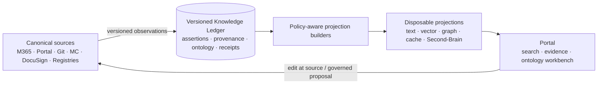

# Unified PLX Document and Knowledge Architecture

Executive architecture report · `TASK-477` · 2026-08-04

Accountable human: Vince (`vince@petrasoap.com`)

## Executive decision

PLX should adopt **Knowledge Ledger with Disposable Projections**.

Business documents and records remain authoritative in SharePoint/Microsoft 365;
customer, product, and vendor workflow state remains authoritative in Portal
gold tables; technical content remains authoritative in Git. SharePoint is the
system of record for Mission Control planning records, while Mission Control is
workflow authority for execution, routing, and evidence policy. DocuSign remains
authoritative for envelope
execution evidence; registries remain authoritative for identities, tools, and
skills.

A Postgres-first bitemporal ledger records versioned assertions, provenance,
ontology releases, ingestion/projection receipts, and tombstones. It does not
become another editable document store. Graph, vector, full-text, cache, and PLX
Second-Brain surfaces are derived, version-stamped, security-trimmed, and
rebuildable.

## Why this architecture

PLX needs cross-system discovery and explanation without weakening ownership.
The selected pattern:

- identifies one canonical source and authoring return path for every object;
- reconstructs what was believed, when it was valid, and when PLX learned it;
- exposes source, revision, owner, derivation, confidence, and conflicts;
- lets administrators evolve business vocabulary safely in a Portal workbench;
- detects duplicate, stale, and contradictory content without deleting it;
- keeps customer/vendor and source ACL boundaries ahead of retrieval;
- maps retention, privacy, residency, and Part 11 controls to explicit owners;
- lets department heads remain accountable while teams and agents execute
  within bounded, revocable autonomy;
- turns the roadmap into schema-validated milestones, dependencies, tasks,
  risks, gates, and evidence.

## Architecture at a glance

The key control is the direction of authority: a search result or memory can
lead back to its source; it cannot silently replace it.

## Portal ontology workbench

Administrators and department stewards can:

1. propose a stable concept, label, synonym, mapping, hierarchy, or deprecation;
2. run structural and policy validation;
3. preview affected documents, assertions, searches, rules, skills, and agents;
4. collect department, Security, Quality, or Legal review based on impact;
5. publish an immutable, effective-dated ontology version;
6. rebuild only affected projections and inspect quality changes;
7. roll back by publishing a new attributable version.

Direct database/RDF editing and self-approval of high-impact changes are outside
the operating model.

## Discovery and knowledge quality

Retrieval is deny by default. Tenant, actor, source ACL, classification,
purpose, retention, and policy filters are applied before ranking, cache reuse,
or generation. Answers display canonical citations, revision time, derivation,
confidence, and unresolved conflicts.

Duplicate and stale-document controls are non-destructive:

- exact IDs and hashes identify byte/source duplicates;
- normalized hashes and similarity identify near duplicates;
- semantic similarity proposes conceptual duplicates;
- source version and authority distinguish revision from duplication;
- review queues route candidates to the accountable department owner.

Staleness is source-aware: an old approved record can be current, while a recent
copy can already be stale. Permission freshness fails closed.

## Records, privacy, residency, and Part 11

Purview remains the source for M365 retention, record labels, legal holds,
disposition, and proof of disposition. The ledger stores policy references and
receipts; derived stores cannot outlive approved source policy or cross
unapproved regions.

For records that Quality and Legal place inside the validated-system boundary,
the design traces:

- validation for intended use;
- accurate and complete record copies;
- protection, retrieval, and approved retention;
- limited system access;
- secure, computer-generated, time-stamped audit trails that preserve prior
  information;
- operational and authority checks;
- training and accountability;
- signature name/date/time/meaning;
- signature uniqueness, identity verification, and record linkage;
- closed/open system classification and corresponding additional controls;
- applicable FDA electronic-signature certification evidence;
- non-biometric signature components, signing-session behavior, and
  genuine-owner controls.

This package is an architecture and validation plan, not a Part 11 compliance
certificate.

## Human and agent operating model

Department heads own meaning, risk, publication, and remediation. Quality and
Legal own regulated-use and validation decisions. Security owns authorization,
privacy, and residency approval.

Registered teams and agents may inventory, classify, propose, build disposable
projections, execute tests, and draft evidence. They cannot decide regulatory
scope, delete canonical records, weaken retention/access/residency, self-register
capabilities, sign for a person, approve their own high-impact ontology change,
or authorize live cutover.

## Zero-drift program

The proposed Mission Control project is `PRJ-UNIFIED-KNOWLEDGE`. `TASK-477`
should be re-homed without duplication. Seven buckets cover foundation,
connectors, ontology, controls, discovery, autonomy, and rollout.

The committed program defines:

- 30 traced requirements;
- 8 dependency-ordered milestones;
- 20 tasks with owners, executors, autonomy bounds, dependencies, repositories,
  and done-when evidence;
- 10 risks;
- 8 approval gates;
- 5 validation commands.

`program.schema.json` freezes the shape.
`scripts/check-unified-knowledge-program.py` validates schema, unique IDs,
references, dependency DAGs, required invariants, milestone task coverage, and
requirement task coverage. Its `--print-mc-plan` mode is deterministic and
non-mutating.

## Delivery sequence

| Milestone | Outcome | Hard gate |
|---|---|---|
| MS-00 | Estate, authority, compliance, privacy, authorization, and deployment facts | All Phase 0 decisions signed |
| MS-01 | Bitemporal ledger and processing receipts | Integrity, backup, and recovery |
| MS-02 | Canonical-source connectors | ACL, deletion, replay, deep-link, degradation |
| MS-03 | Portal ontology workbench | Administrator usability and reversible publication |
| MS-04 | Records, privacy, residency, and Part 11 controls | Quality/Legal/Security qualification |
| MS-05 | Rebuildable projections and semantic discovery | Rebuild, quality, explanation, and leakage benchmarks |
| MS-06 | Bounded agent/human workflows | Capability, revocation, approval, and MC evidence |
| MS-07 | Architecture pilot and cutover readiness | Recovery, rollback, SLO, and owner approvals |

## Phase 0 blockers

No implementation should proceed until:

1. the live Microsoft 365 estate, licenses, Purview features, regions,
   administrators, and Graph permissions are evidenced;
2. pinned Portal and PLX Second-Brain repositories and runtime contracts are
   accessible;
3. Quality and Legal approve Part 11 intended use and the validated-system
   boundary;
4. identity, tenant isolation, privacy, purpose, and authorization policy is
   approved;
5. ledger/audit-store hosting, encryption, backups, recovery, residency, and
   bitemporal semantics are approved.
6. the recurring mirror-is-boring gate reports live, fresh data with
   `boringGateMet` true before ontology, discovery, or another new plane starts.

The Portal repository was not readable by this Cloud Agent, so the recorded
decision to reuse Ricardo's Portal document stack is preserved but not
misrepresented as independently verified.

## Pilot

Use the existing Git-authoritative architecture collection first. It already
declares generated-consumer status, provenance, canonical links, authoring
return paths, and degraded behavior when Second-Brain is unavailable.

Pilot success requires complete provenance, correct authority recovery by
technical and nontechnical users, no ACL/tenant leakage, visible staleness and
conflict, usable canonical links during projection outages, zero-state
projection rebuilds, deletion/ACL propagation, ontology rollback, and Mission
Control evidence for every action.

## Rollback

Disable the affected connector, capability, or projection; return users to
canonical links and the prior approved projection; publish ontology rollback as
a new version; rebuild from the last approved ledger watermark; preserve all
source, ledger, audit, validation, and incident evidence; reopen the controlling
Mission Control task before resuming.

Rollback never rewrites canonical documents or deletes ledger history.

## Package

- `index.md` — canonical entry point
- `REQUIREMENTS.md` — requirement and acceptance contract
- `RESEARCH.md` — recovered evidence, independent source research, alternatives
- `SPEC.md` — detailed architecture and rollout specification
- `DECISIONS.md` — approved decisions and unresolved gates
- `REPORT.md` — this executive report
- `program.json` / `program.schema.json` — zero-drift execution contract
- PDF / DOCX — generated, shareable consumers of this report
