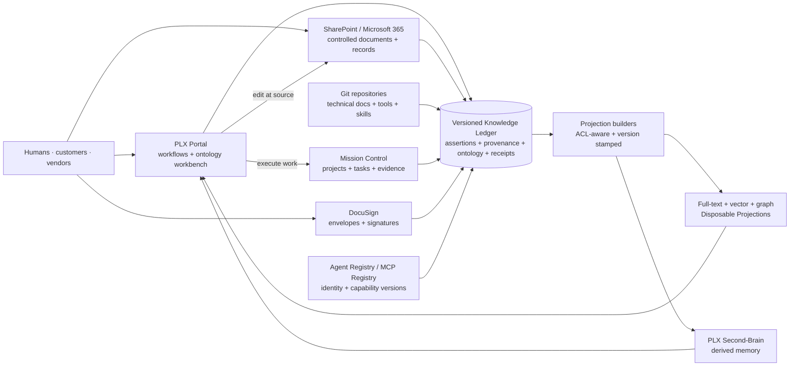
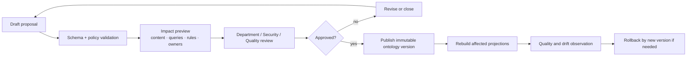

# Specification — Unified PLX Document and Knowledge Architecture

Status: approved architecture, implementation gated.
Source task: `TASK-477`.
Accountable owner: `vince@petrasoap.com`.
Architecture pattern: **Knowledge Ledger with Disposable Projections**.

## 1. Purpose

PLX needs one trustworthy way for humans and agents to discover documents,
decisions, operating knowledge, evidence, and relationships across Portal,
Microsoft 365, PLX Second-Brain, Mission Control, Agent Registry, MCPs, tools,
skills, DocuSign, Git, customers, and vendors.

"Unified" means a common authority, identity, provenance, ontology, discovery,
and explanation contract. It does not mean copying every source into one
editable database.

## 2. Governing principles

1. **Canonical sources stay canonical.** SharePoint/Purview owns controlled
   business documents and records; Portal gold tables own workflow state; Git
   owns technical contracts; Mission Control owns execution; DocuSign owns
   envelope execution evidence; registries own identities and packages.
2. **The ledger owns assertions, not source documents.** It records versioned
   claims, provenance, ontology versions, ingestion receipts, tombstones, and
   resolution state.
3. **Every projection is disposable.** Graph, vector, full-text, caches,
   summaries, and Second-Brain can be erased and rebuilt.
4. **Authorization precedes retrieval.** Source and tenant policy is evaluated
   before ranking, caching, synthesis, or answer generation.
5. **Changes are explainable and reversible.** Ontology and assertion changes
   are versioned, reviewed, attributable, effective-dated, and rollbackable by
   publishing a new version.
6. **Humans own outcomes.** Department heads remain accountable; teams and
   agents execute within bounded, revocable capabilities.
7. **Compliance scope is explicit.** Quality and Legal decide intended use,
   regulated records, signatures, validation boundary, and evidence.
8. **Execution cannot drift from the spec.** `program.json` is the dispatch
   contract and its schema/validator fail closed on missing owners, dangling
   references, cycles, invariant loss, or requirement gaps.

## 3. System context

The arrows into the ledger represent governed event/metadata/assertion
ingestion, not authority transfer. The Portal returns a user to the canonical
source for edits. It can create a governed ontology or assertion proposal, but
cannot silently rewrite source-owned content.

## 4. Authority model

Each indexed object has:

- `canonical_system`
- `canonical_uri`
- `canonical_object_id`
- `canonical_revision`
- `authority_class`
- `business_owner`
- `authoring_return_uri`
- `security_policy_ref`
- `retention_policy_ref`
- `residency_policy_ref`

Authority classes are:

- `canonical`: source record/file/package authority.
- `workflow-authority`: authoritative process state or approved proposal flow.
- `execution-authority`: project/task/evidence state.
- `registry-authority`: identity, capability, package, or tool contract.
- `derived`: disposable memory, index, summary, ranking, or view.

The complete system-by-system matrix is machine readable in `program.json`.

## 5. Knowledge ledger

### 5.1 Scope

The ledger stores:

- stable object and actor identities;
- source revision observations;
- immutable assertions and assertion supersession;
- valid-time and transaction-time ranges;
- W3C PROV-aligned entities, activities, agents, derivations, attributions,
  revisions, invalidations, and delegations;
- immutable ontology releases and concept mappings;
- connector, extraction, chunking, embedding, projection, and deletion receipts;
- security, retention, residency, and policy references;
- duplicate, staleness, contradiction, and human-resolution findings;
- tombstones that remove content from projections without deleting audit history.

It does not store an independently editable copy of an authoritative business
document.

### 5.2 Bitemporal model

Every assertion has:

- `assertion_id`: stable identity for the claim lineage.
- `assertion_version_id`: immutable version.
- `valid_during`: when the claim is understood to be true in the business
  domain.
- `recorded_during`: when PLX knew and retained that version.
- `supersedes`: prior version, if any.
- `source_revision_id`: immutable revision observed at ingestion.
- `status`: proposed, active, contradicted, superseded, retracted, or tombstoned.

Corrections append a new version and close the prior transaction-time range.
They never overwrite history. PostgreSQL timestamp ranges and exclusion
constraints are a suitable implementation primitive, subject to Phase 0
deployment, backup, residency, and validation approval.

### 5.3 Provenance

Minimum provenance for every assertion or chunk:

- canonical source and revision;
- source owner and source ACL snapshot/reference;
- ingestion activity and connector version;
- extraction/chunking activity and parser version;
- ontology version used for classification;
- model and prompt version for model-derived assertions;
- responsible human/service/agent identity;
- confidence and evidence span;
- projection build and ledger watermark;
- invalidation, supersession, or deletion activity.

The UI renders the chain as "source → extraction → assertion → projection →
answer." Missing links create a visible degraded state and can block generated
answers.

## 6. Canonical-source connectors

All connectors implement one contract:

1. identify and pin the source object/revision;
2. fetch with an approved least-privilege identity;
3. preserve source ACL, tenant, classification, retention, and residency refs;
4. normalize metadata without changing source meaning;
5. create idempotent ingestion receipts;
6. emit source revisions, permission changes, and tombstones;
7. checkpoint an opaque cursor where the source supports it;
8. replay safely and reconcile periodically;
9. expose canonical read and authoring-return links;
10. fail independently and visibly.

### 6.1 Microsoft 365

- SharePoint/Purview remains authority for controlled documents, record labels,
  holds, disposition, and source versions.
- Graph delta tokens are opaque and persisted exactly as returned.
- Change notifications accelerate ingestion but never replace delta/full
  reconciliation.
- Managed metadata and content types are mapped only after the live tenant,
  license, Term Store, and records estate are approved.
- Broad application search/private-content indexing is prohibited without
  explicit Security, Privacy, and residency approval.

### 6.2 Portal

- Reuse the existing Portal document, evidence, customer, vendor, and DocuSign
  stack after a pinned implementation review.
- Portal gold tables remain workflow authority.
- The connector emits approved facts and links; it does not duplicate write
  paths.
- Customer and vendor tenant predicates are mandatory before extraction and
  retrieval.

### 6.3 Git, tools, and skills

- Ingest immutable commit SHA, path, release/tag, ownership, and package
  metadata.
- Installed skill copies are not canonical; the catalog pin and source
  repository are.
- Authoring returns through a governed pull request.

### 6.4 Mission Control and registries

- Projects, buckets, tasks, milestones, risks, evidence, and checkouts retain
  Mission Control authority.
- Agent Registry and MCP/tool/skill registries provide versioned identities,
  reviewed capabilities, revocation, owner, and integration boundaries.
- Every mutating agent action has a registered principal, task, accountable
  human, policy decision, tool version, parameters classification, and receipt.

### 6.5 DocuSign

- DocuSign remains authority for envelope execution and signature certificate
  evidence.
- Store envelope ID, signer identity reference, routing/status events, document
  hash/revision, signature meaning, certificate/archive link, and retention
  policy reference.
- Never imply that DocuSign alone satisfies Part 11; intended use, configuration,
  identity, signature manifestation, record linkage, retention, and validation
  require Quality/Legal approval and qualification.

## 7. Portal ontology workbench

The workbench makes ontology stewardship safe for administrators without direct
database, RDF, or Term Store manipulation.

### 7.1 Roles

- **Viewer:** browse current concepts and provenance.
- **Proposer:** draft labels, synonyms, mappings, hierarchy, and deprecations.
- **Department steward:** accountable for domain meaning and impact.
- **Ontology administrator:** validates structural and cross-domain integrity.
- **Quality/Legal reviewer:** approves regulated-domain implications.
- **Publisher:** publishes an immutable release after required approvals.

No role can both bypass required review and publish its own high-impact change.

### 7.2 Workflow

### 7.3 Workbench capabilities

- stable concept IDs;
- preferred, alternate, hidden, and multilingual labels;
- broader, narrower, related, exact, and close mappings;
- ownership, scope, status, effective dates, rationale, and evidence;
- draft branches and side-by-side version diff;
- validation for duplicate labels, cycles, orphan concepts, forbidden mappings,
  broken references, missing owners, and regulated-domain controls;
- impact preview over affected documents, assertions, queries, rules, skills,
  agents, and projections;
- sampled search preview before publication;
- attributable comments, approvals, signatures where required, and publication
  receipt;
- deprecation/migration mappings rather than identity reuse;
- rollback that publishes a new version and triggers a targeted rebuild.

## 8. Disposable projections

Projection builders consume a ledger watermark plus ontology/policy/model
versions and emit a signed build receipt.

### 8.1 Projection types

- **Full text:** exact terms, titles, identifiers, labels, and source metadata.
- **Vector:** semantic chunks with model/version and source evidence spans.
- **Graph:** identities, assertions, provenance, ontology, ownership, and
  cross-system relationships.
- **Second-Brain:** confidence-weighted derived memory and retrieval context.
- **Caches/materialized views:** bounded-latency application reads.

### 8.2 Rebuild contract

A rebuild starts from empty storage and:

1. selects an immutable ledger watermark and policy/ontology versions;
2. processes only authorized projection inputs;
3. produces deterministic object IDs where feasible;
4. records counts, checksums, errors, omissions, and model versions;
5. compares against expected cardinality and quality thresholds;
6. swaps an immutable candidate into service only after validation;
7. retains the prior projection for bounded rollback;
8. never changes canonical sources or ledger history.

## 9. Discovery, explanation, and knowledge quality

### 9.1 Retrieval sequence

1. authenticate actor and tenant;
2. resolve registered identity/capabilities;
3. construct source, classification, retention, and tenant policy filters;
4. retrieve lexical, semantic, and graph candidates inside those filters;
5. merge/rerank with source authority, freshness, and quality signals;
6. detect conflicts and insufficient evidence;
7. generate only from authorized evidence;
8. return citations, revision dates, confidence, derivation, conflicts,
   canonical links, and authoring-return links;
9. append an attributable retrieval/answer receipt without storing restricted
   answer text beyond approved policy.

### 9.2 Duplicate detection

Use a layered, non-destructive candidate pipeline:

- source-native IDs and hashes for exact duplicates;
- normalized text/content hashes;
- title, owner, date, content-type, and ontology blocking;
- MinHash/similarity for near duplicates;
- vector similarity for semantic candidates;
- source authority and version relationships to distinguish copies, revisions,
  translations, templates, and true duplicates.

Department owners decide link, supersede, migrate, retain, or mark false
positive. No detector auto-deletes canonical content.

### 9.3 Staleness

Staleness is policy-specific, not simply "old":

- source revision is newer than the indexed revision;
- owner-defined review date has passed;
- cited dependency or ontology concept changed;
- record status or workflow state contradicts the document;
- connector/ACL watermark exceeds the approved freshness budget;
- canonical object is missing or inaccessible.

The result is a visible state, owner queue, and projection ranking signal.
Authorization staleness fails closed.

### 9.4 Contradictions

Contradictions preserve all evidence:

- identify competing assertions and evidence spans;
- compare canonical authority, valid time, transaction time, owner, and status;
- auto-resolve only deterministic version/supersession relationships;
- route semantic or policy conflicts to the accountable department head;
- display unresolved conflict in results and prohibit unsupported synthesis.

## 10. Security, privacy, retention, and residency

- Central, typed, deny-by-default authorization; no prompt-only controls.
- Separate human, customer, vendor, service, agent, connector, and projection
  identities.
- Least-privilege connector permissions and independent kill switches.
- Tenant and purpose predicates attached at ledger and projection time.
- Encryption in transit and at rest with approved key ownership/rotation.
- Sensitive source text minimized; embeddings treated as potentially sensitive.
- Cache keys include actor/tenant/policy version or use no shared answer cache.
- Permission and deletion events remove content from projections within an
  approved service level while retaining compliance-safe audit receipts.
- Purview remains the source of M365 retention/hold/disposition truth.
- Ledger/projection retention is mapped to source policy; derived copies cannot
  outlive or evade an approved disposition unless a legal hold requires it.
- M365, Postgres, projection, backup, model, and observability regions are all
  inventoried; one vendor's residency statement does not cover the others.

## 11. Part 11 traceability

Part 11 controls are activated only for the records and intended uses approved
by Quality and Legal.

| Control area | Architecture control | Validation evidence |
|---|---|---|
| Intended use and validation | Approved boundary, risk assessment, requirements, configuration, qualification, and change control | Validation plan/report and requirements trace matrix |
| Accurate and complete copies | Canonical revision export with metadata, signatures, audit trail, and readable long-term format | Record-copy protocol |
| Record protection/retrieval | Source retention/hold plus tested ledger/receipt backup and indexed retrieval | Retention and retrieval qualification |
| Access limitation | Unique identity, deny-by-default authorization, capability/version checks | Positive/negative access protocols |
| Time-stamped audit trail | Append-only attributable events for create/modify/delete/publish/sign/execute; prior data remains visible | Audit-trail qualification and periodic review procedure |
| Operational/authority checks | Enforced workflow order, owner/publisher separation, task and capability checks | Sequence and authority scenarios |
| Training/accountability | Named roles, training records, policy acknowledgement, disciplinary policy ownership | SOP and training evidence |
| Signature manifestation | Name, date/time, and meaning rendered with the record | Signature manifestation protocol |
| Signature-record linkage | Envelope/signature identifiers and hashes linked to immutable record revision | Linkage and copy protocol |
| Identification-code controls | Identity verification, uniqueness, credential lifecycle, compromise response | IAM and DocuSign qualification |

This mapping is a design trace, not a compliance certificate.

## 12. Governance and bounded autonomy

Every milestone, task, risk, and gate has a human owner. Agents may:

- inventory and classify within approved read scopes;
- propose mappings, duplicates, stale states, and ontology changes;
- build and test disposable projections;
- draft evidence and Mission Control updates.

Agents may not:

- decide Part 11 applicability;
- approve their own ontology publication or validation deviations;
- alter retention, legal hold, privacy, residency, tenant, or access policy;
- delete canonical content;
- grant capabilities or register themselves;
- sign on behalf of a person;
- mark a live cutover approved.

Department heads own meaning, risk acceptance, publication, and remediation.
Quality/Legal own regulated controls. Security owns authorization and privacy
approval. Operators can revoke connectors, agents, and projections without
making canonical sources unreadable.

## 13. Mission Control program shape

Create `PRJ-UNIFIED-KNOWLEDGE` and re-home `TASK-477` without duplicating it.
Use seven delivery buckets:

1. `BKT-UKA-FOUNDATION` — Phase 0 plus ledger foundation.
2. `BKT-UKA-CONNECTORS` — canonical-source connectors.
3. `BKT-UKA-ONTOLOGY` — Portal ontology workbench.
4. `BKT-UKA-CONTROLS` — security, privacy, records, and Part 11.
5. `BKT-UKA-DISCOVERY` — disposable projections and discovery quality.
6. `BKT-UKA-AUTONOMY` — Agent Registry, MCP, tool, skill, and human gates.
7. `BKT-UKA-ROLLOUT` — pilot, validation, cutover, and operations.

`program.json` defines eight dependency-ordered milestones (`MS-00` through
`MS-07`), 20 implementation tasks, 26 requirements, 10 risks, and eight gates.
The validator emits a non-mutating Mission Control import plan. Creating or
re-homing actual MC records is a separately approved execution action.

## 14. Delivery sequence

- **MS-00:** prove estate, authority, compliance, authorization, privacy, and
  deployment facts.
- **MS-01:** implement and qualify the versioned ledger/receipt contracts.
- **MS-02:** connect canonical systems with ACL/deletion/replay/degradation.
- **MS-03:** deliver safe administrator ontology evolution.
- **MS-04:** qualify records, privacy, residency, audit, and signature controls.
- **MS-05:** build/rebuild projections and pass discovery/quality/isolation
  benchmarks.
- **MS-06:** enforce agent/human autonomy and zero-drift dispatch.
- **MS-07:** pilot architecture collection, validate recovery/rollback/SLOs,
  obtain control-owner approvals, then cut over.

No milestone may be marked complete while a dependency, requirement, risk, gate,
or evidence item is missing.

## 15. Pilot and rollout

The first collection is the existing Git-authoritative architecture pack because
its authority, provenance, degradation, and authoring-return behavior already
exists.

Pilot acceptance:

- complete source/revision/provenance coverage;
- correct technical and nontechnical recovery of authority facts;
- lexical and semantic queries meet approved relevance thresholds;
- no tenant/ACL leakage;
- stale/contradictory source state is visible;
- canonical links work with ledger, vector, graph, or Second-Brain disabled;
- all projections rebuild from zero with receipts;
- deletion and permission changes remove derived content on time;
- operators can roll back ontology and projection releases;
- every pilot action links to a Mission Control task and evidence.

Rollout proceeds collection by collection and department by department. A failed
gate stops only the affected collection/connector where isolation permits; it
never lowers the shared control.

## 16. Operations and rollback

Required operating signals:

- connector cursor age, lag, errors, replay count, and reconciliation drift;
- source/ledger/projection cardinality and receipt checksums;
- ACL/deletion propagation time;
- ontology and projection version skew;
- retrieval quality, unsupported-answer, conflict, duplicate, and stale rates;
- cross-tenant leakage tests;
- audit/retention/backup/recovery status;
- agent/tool policy decisions and revocations.

Rollback order:

1. disable affected connector, agent capability, or projection;
2. return discovery to canonical links and last approved projection;
3. publish ontology rollback as a new version;
4. rebuild from the last approved ledger watermark;
5. preserve all source, ledger, audit, validation, and incident evidence;
6. reopen the controlling Mission Control task and obtain human approval before
   resuming.

Because projections are disposable, rollback never requires rewriting canonical
documents or deleting ledger history.
